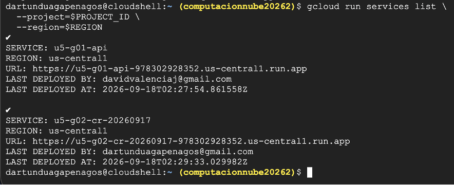
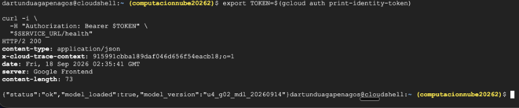
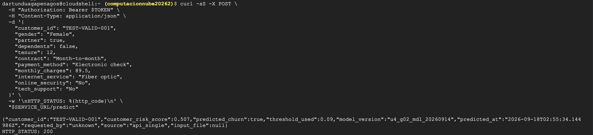
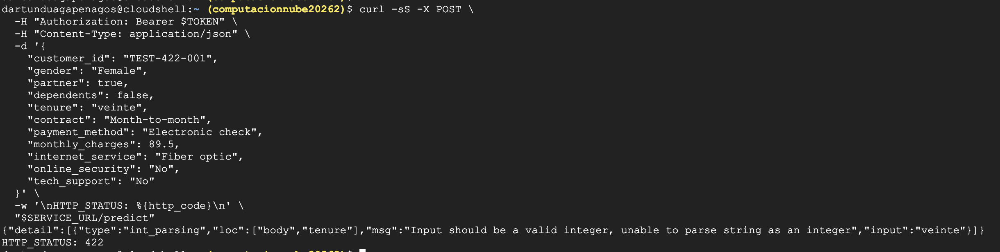

# Evidencias de despliegue U5 — Servicio de churn

**Grupo:** 02  
**Integrantes:** Gabriel Escobar Bravo · David Artunduaga Penagos · Luis Manuel Rojas  
**Proyecto GCP:** `computacionnube20262`  
**Servicio Cloud Run:** `u5-g02-cr-20260917`  
**Región:** `us-central1`

## 1. Servicio activo en Cloud Run

La salida de `gcloud run services list` confirma que el servicio del grupo 02 fue desplegado correctamente en el proyecto indicado y aparece activo en la región `us-central1`.

## 2. Endpoint `/health`

La respuesta HTTP `200` confirma que el servicio responde correctamente y que la aplicación está disponible para recibir solicitudes.

## 3. Predicción válida en `/predict`

La respuesta HTTP `200` demuestra que el contrato de entrada fue aceptado y que el modelo devolvió un puntaje de riesgo, una predicción de churn, el threshold utilizado y la versión del modelo.

## 4. Validación de entrada con respuesta `422`

La respuesta HTTP `422` se genera porque `tenure` recibió el texto `veinte` en lugar de un entero. Esto demuestra que el contrato protege el servicio frente a tipos de datos inválidos.

## Resumen

Las evidencias confirman el despliegue del servicio, la disponibilidad del endpoint de salud, una predicción válida y el rechazo de una solicitud que no cumple el esquema de entrada. El modelo utilizado corresponde a `u4_g02_mdl_20260914`.
